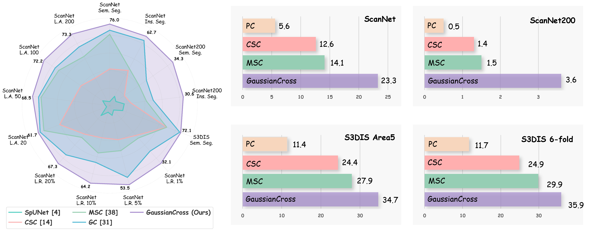
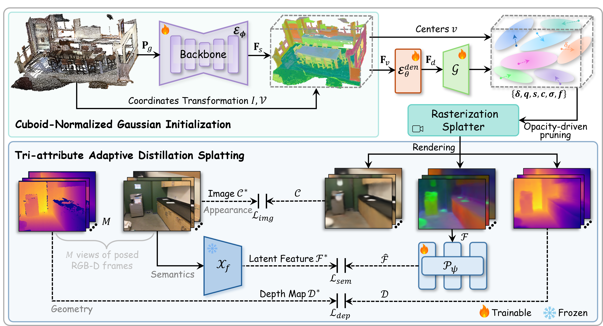

<div align="center">

# GaussianCross: Cross-modal Self-supervised 3D Representation Learning via Gaussian Splatting
ACM MM2025

[Lei Yao](https://rayyoh.github.io/), [Yi Wang](https://wangyintu.github.io/), [Yi Zhang](https://cindy0725.github.io/), [Moyun Liu](https://lmomoy.github.io/), [Lap-Pui Chau](https://www.eie.polyu.edu.hk/~lpchau/)

<a href=""></a>
<a href="https://rayyoh.github.io/GaussianCross/"></a>
<a href="https://github.com/pre-commit/pre-commit">
<a href="https://huggingface.co/RayYoh/GaussianCross">
<a href="LICENSE">




</div>

## :memo: To-Do List
- [ ] Environment installation instructions.
- [ ] Instructions for processing (pretraining) dataset.
- [x] Processing (pretraining) code.
- [x] Release downstream training configs.
- [x] Release trained weights and experiment record.
- [ ] Release pretraining code.

## 🌟 Pipeline



## :hammer: Installation
Our model is built on Pointcept toolkit, you can follow its [official instructions](https://github.com/Pointcept/Pointcept?tab=readme-ov-file#installation) to install the packages:

```bash
conda create -n GaussianCross python=3.8 -y
conda activate GaussianCross

xxx
```
Note that they also provide scripts to build correponding docker image: [build_image.sh](https://github.com/Pointcept/Pointcept/blob/main/scripts/build_image.sh)


## :mag: Data Preprocessing 
**ScanNet V2 & ScanNet200**
- Download the [ScanNet V2](http://www.scan-net.org/) dataset.
- Run preprocessing code for raw ScanNet as follows:

```bash
xxx
```
- Link processed dataset to codebase:
```bash
# PROCESSED_SCANNET_DIR: the directory of the processed ScanNet dataset.
mkdir data
ln -s ${PROCESSED_SCANNET_DIR} ${CODEBASE_DIR}/data/scannet
```
**S3DIS**

We use the preprocessd S3DIS data from [Pointcept](https://github.com/Pointcept/Pointcept?tab=readme-ov-file#s3dis).
- Link processed dataset to codebase:
```bash
# PROCESSED_SCANNET_DIR: the directory of the processed S3DIS dataset.
ln -s ${PROCESSED_SCANNET_DIR} ${CODEBASE_DIR}/data/s3dis
```


## 🚀 Training
Same to [Pointcept](https://github.com/Pointcept/Pointcept), the training process is based on configs in `configs` folder. The training scripts will create an experiment folder in `exp` and backup essential code in the experiment folder. Training config, log file, tensorboard, and checkpoints will also be saved during the training process.

**Attention:** Note that a cricital difference from Pointcept is that most of data augmentation operations are conducted on GPU in this [file](/pointcept/custom/transform_tensor.py). Make sure `ToTensor` is before the augmentation operations.

Download the pretrained 3D backbone from [GaussianCross](https://huggingface.co/RayYoh/GaussianCross/blob/main/pretrain-gs-v4-spunet-base/model/model_last.pth).

**ScanNet V2**
```bash
# Load the pretrained model
WEIGHT="path/to/downloaded/model/model_last.pth"

# Linear Probing
CUDA_VISIBLE_DEVICES=0,1,2,3 sh scripts/train.sh -g 4 -d scannet -c semseg-spunet-base-lin -n semseg-spunet-base-lin -w $WEIGHT
# Semantic Segmentation
CUDA_VISIBLE_DEVICES=0,1,2,3 sh scripts/train.sh -g 4 -d scannet -c semseg-spunet-base -n semseg-spunet-base -w $WEIGHT
# Instance Segmentation
CUDA_VISIBLE_DEVICES=0,1,2,3 sh scripts/train.sh -g 4 -d scannet -c insseg-pg-spunet-base -n insseg-pg-spunet-base -w $WEIGHT
# Paramater Efficiency and Data Efficiency
CUDA_VISIBLE_DEVICES=0,1,2,3 sh scripts/train.sh -g 4 -d scannet -c semseg-spunet-efficient-[la20-lr20] -n semseg-spunet-efficient-[la20-lr20] -w $WEIGHT
```

**ScanNet200**
```bash
# Linear Probing
CUDA_VISIBLE_DEVICES=0,1,2,3 sh scripts/train.sh -g 4 -d scannet200 -c semseg-spunet-base-lin -n semseg-spunet-base-lin -w $WEIGHT
# Semantic Segmentation
CUDA_VISIBLE_DEVICES=0,1,2,3 sh scripts/train.sh -g 4 -d scannet200 -c semseg-spunet-base -n semseg-spunet-base -w $WEIGHT
# Instance Segmentation
CUDA_VISIBLE_DEVICES=0,1,2,3 sh scripts/train.sh -g 4 -d scannet200 -c insseg-pg-spunet-base -n insseg-pg-spunet-base -w $WEIGHT
```

**S3DIS**
```bash
# Linear Probing
CUDA_VISIBLE_DEVICES=0,1,2,3 sh scripts/train.sh -g 4 -d s3dis -c semseg-spunet-base-area[1-5] -n semseg-spunet-base-area[1-5] -w $WEIGHT
# Semantic Segmentation
CUDA_VISIBLE_DEVICES=0,1,2,3 sh scripts/train.sh -g 4 -d s3dis -c semseg-spunet-base-area[1-5]-lin -n semseg-spunet-base-area[1-5]-lin -w $WEIGHT
```

## :books: License

This repository is released under the [MIT license](LICENSE).

## :clap: Acknowledgement
The research work was conducted in the JC STEM Lab of Machine Learning and Computer Vision funded by The Hong Kong Jockey Club Charities Trust.

Our code is primarily built upon [Pointcept](https://github.com/Pointcept/Pointcept), [Ponder V2](https://github.com/OpenGVLab/PonderV2) and [gsplat](https://github.com/nerfstudio-project/gsplat).

## :pencil: Citation

```bib
@article{yao2025gaussian,
  title={GaussianCross: Cross-modal Self-supervised 3D Representation Learning via Gaussian Splatting},
  author={Yao, Lei and Wang, Yi and Zhang, Yi and Liu, Moyun and Chau, Lap-Pui},
  journal={xxx},
  year={2025},
  publisher={xxx}
}
```